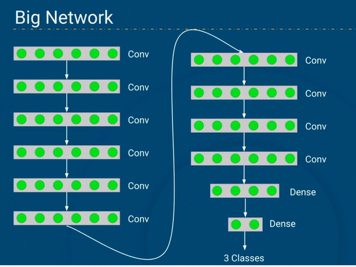

## 01 - Common Errors In PyTorch Sequential Model

PyTorch's `n.Sequential` offers a streamlined method for constructing neural networks. This sequential approach is particularly effective for crafting straightforward architectures where each layer directly feeds into the subsequent one. However, when building these models, it's crucial to exercise caution, as inadvertent layer sizing issues can result in runtime errors or unexpected model behavior.

We'll consider the following common error scenarios when constructing a PyTorch Sequential model:

* Incorrect layer sizing, both in the input layer and after flattening a convolutional layer
* Accidental layer duplication
* Forgetting to flatten between convolutional and linear layers

These scenarios will emphasize the importance of paying careful attention and verification when creating neural network architectures.

Kaggle Dataset: [Crop Disease in Uganda](https://www.kaggle.com/competitions/cassava-leaf-disease-classification)

## 02 - Exploring the Cassava Disease Dataset

**Summary:** In this lesson, we'll explore the dataset for this project. We'll be looking at images of crops in Uganda, some healthy and some with different diseases. We'll also prepare the data for later lessons.

**Objectives:**
* Check the properties of our image data
* Normalize the data set
* Check the number of data points in each class
* Balance the classes, so each has the same number of observations

**New Terms:**
* Unbalanced classes
* Undersampling

##  03 - Cross Entropy
**Introduction**
* Classification: categorize input into pre-defined classes
* Supervised learning --> need an error metric, a loss function
* Loss function in classification problem?

**What is cross entropy?**
* Measures the difference: prediction Vs true lables
* Penalizes incorrect predictions and rewards accurate predictions
*Example:*

### Cross Entropy in action:

**Optimization and Training**
* During training cross-entropy loss is minimized
* Training with techniques like gradient descent
* Even a small step toward better predictions improves cross-entropy
* Models with minimal cross-entropy -> often high accuracy

## Excersie - Deep Neural Network

**Summary:** In this lesson, we'll continue using images of crop disease from Uganda. We'll build a convolutional neural network and train it to classify images into one of five classes. We'll take this lesson as an opportunity to highlight the dangers of overfitting.

**Objectives:**
* Convert images from grayscale to RGB
* Resize images
* Normalize our data
* Create a transformation pipeline to standardize images for training
* Create a Convolutional Neural Network
* Train the network to do multiclass classification
* Identify overfitting

**New Terms:**
* Overfitting
* Learning curve

##  04 Transfer Learning and Cross Validation

**Transfer learning** is a technique where a model pre-trained on one task (usually with a large dataset like ImageNet) is reused and fine-tuned for a new but related task.
It saves time, improves accuracy, and is especially useful when you have limited data.
**Example:** Using a pre-trained model like VGG16 or ResNet to classify medical images.

**Cross-validation** is a model evaluation technique that splits the data into multiple subsets (folds), trains the model on some folds, and tests it on the remaining ones.
This process repeats several times, giving a more reliable estimate of model performance.
**Most common type:** k-fold cross-validation, where data is split into k parts and the model is trained/tested k times.

**Small Network**

**Big Network**

## Exercise - Transfer Learning and Cross Validation
**Summary:** In this lesson, we'll further improve our model using Transfer Learning. We'll take a publicly available image classification model that someone else has already trained and alter it to meet our needs. We'll only need to train the altered part, vastly improving both our training speed and model performance. We'll evaluate the model's performance with the more robust k-fold cross-validation method.

**Objectives:**
* Load our competition data
* Download a pre-trained model
* Alter that model to suit our needs with Transfer Learning
* Train just the altered part
* Test model performance with k-fold cross-validation

**New Terms:**
* Pre-trained model
* Transfer learning
* K-fold Cross validation

## 05 - Transfer Learning and Callbacks
Callbacks are tools in machine learning that allow you to monitor and control the training process of a model. They can automatically perform actions like:

* Stopping training early if performance stops improving (EarlyStopping)
* Saving the model during training (ModelCheckpoint)
* Adjusting the learning rate (ReduceLROnPlateau)

#### Early Stopping
* Halts training when condition is met
* Typically validation loss stops improving
* Needs "patience"
`early_stopping(watch="val_loss, patience=5)`

### Checkpointing
* Usually save model after training
* Can include some overfitting or noise
* Earlier steps might be better
* If training interrupted, have to start over
* Checkpointing saves model during training
* Usually every epoch with better validation loss
`checkpointing(watch="val_loss)`

### Learning Rate Scheduling
* Want bigger steps at first
* Smaller steps at end
* Adam works well
* Can help it by changing learning rate
`lr_scheduler(freq, decrease_rate)`

## Exercise: - Transfer Learning and Callbacks
**Summary:** In this lesson, we'll build another classifier model that predicts the crop disease on images of cassava plants from Uganda. We'll again use Transfer Learning, where a model trained for a task is reused as the starting point for a model on a different task. We'll also delve into Callbacks, which are powerful tools to customize the behavior of your model during training. Specifically, we'll focus on Learning Rate Scheduling, Checkpointing, and Early Stopping to enhance our model's training process.

**Objectives:**
* Read in data with multiple classes
* Transform data and prepare it for training
* Use Transfer Learning to train a classifier model on cassava images
* Improve training by implementing various callbacks
* Prepare a submission for our competition by reformatting network predictions on the test set

**New Terms:**
* Callbacks
* Learning Rate Scheduling
* Checkpointing
* Early Stopping

## 06 - Data Pollution & Power
The following is a fragment from the white paper [Data Pollution & Power (2022)](https://gryhasselbalch.com/books/data-pollution-power-a-white-paper-for-a-global-sustainable-development-agenda-on-ai/) published by the Bonn Sustainable AI Lab, Institute for Science and Ethics, University of Bonn.

References
Hasselbalch, G. (2022) Data Pollution & Power – White Paper for a Global Sustainable Agenda on AI, The Sustainable AI Lab, Bonn University.