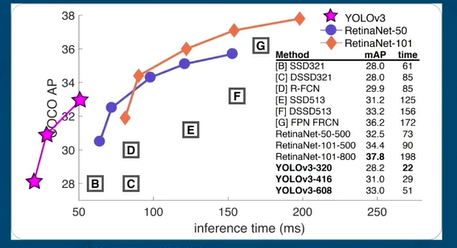
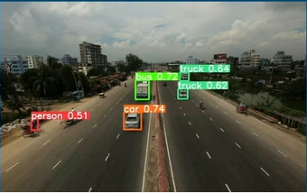
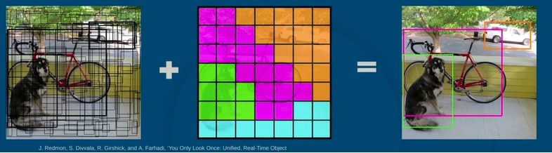
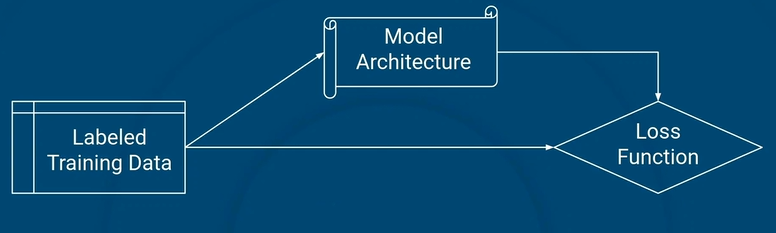
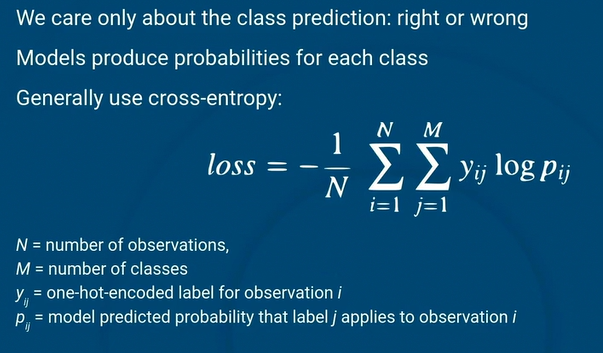
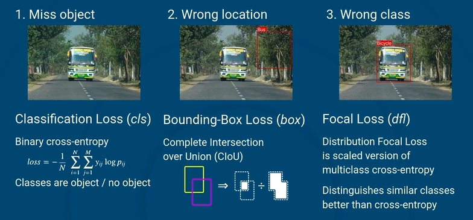
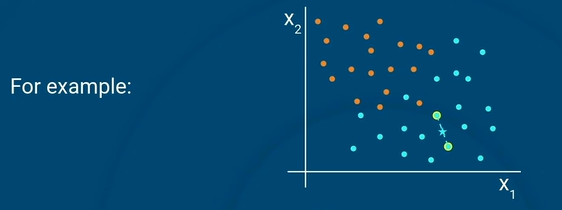
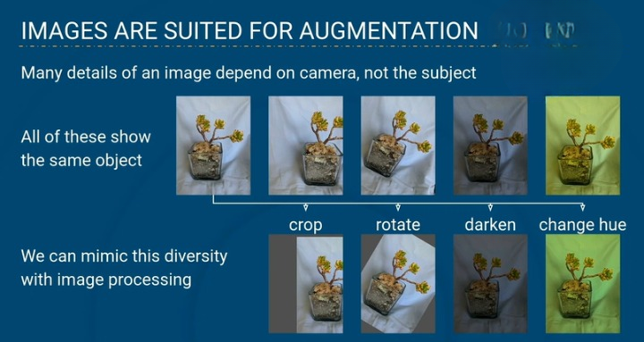

## 01 - Python's `pathlib` module
 
The pathlib module in Python provides an elegant interface for working with file system paths. The pathlib module offers many advantages over the older os.path way, such as a consistent way to handle paths across different operating systems. The pathlib module does this by treating paths as objects rather than strings. The module also provides methods for common file operations, making tasks like listing directory contents, creating directories, and searching for files more straightforward.

## 02 - Object Detection
Object detection is a computer vision task that involves identifying and locating objects in images or video.

* Identify, locate and label multiple objects within an image
* Multiple possible outputs per image
* More complex, must account for multiple aspects of the prediction
   * Presence of objects
   * Class of each object
   * Location of each object in a bounding box

**Object Detection Application**
* Wildlife monitoring 
* Traffic data

### Object Detection Components
* Model Architecture - Focus on YOLO (You Only Look Once)
* Pretrained models 
     - Fixed architecture
     - Pre-trained weights for common objects
* Training custom models
    - For custom classes
    - Need labeled data
    - Define loss function for the multiple parts of object detection

## Exercise - Traffic data as image and videos

**Summary:** In this lesson, we'll learn how to work with image and video data for object detection. We'll explore the specific traffic dataset for this project. The focus will be on how video data can be converted to images, understanding bounding boxes for object classification, and using XML annotations to represent those bounding boxes.

**Objectives:**
Load and organize the project dataset, separating images and their corresponding XML annotations.
Extract frames from a video at regular intervals.
Parse XML annotations.
Visualize bounding boxes on image data.

**New Terms:**
Bounding boxes
Frame rate
XML

## 03 - Object Detection with YOLO
**Object Detetction models**
The deformation model and region based CNNs (R-CNN)
Need something fast enough for real-time detection
A typical frame rate is 30fps -> apporximately 30ms/frame

**Key Points**
* You Only Look Once (YOLO) makes one pass of the image
* Popular because it's fast and accurate
* YOLO produces bounding boxes around detected objects
* YOLO classifies the detected objects

**How YOLO Works**
* Bounding boxes are created for each grid cell: [x, y, w, h, c]
* Class probabilities are predicted for each grid cell: [p1, p2,.....,pk]
* These two results are assembled to created the bounding boxes and class probabilities

## Exercise - Video Object Detection with YOLO

**Summary:** In this lesson, we won't just classify images but we'll take it a step further by detecting objects within them. We'll use a popular object detection model called YOLO (You Only Look Once).

**Objectives:**
* Detect objects in an image using the YOLO model
* Parse the results from running the YOLO model
* Display the resulting bounding boxes from running the YOLO model
* Detect objects from a variety of sources, including videos and images stored in directories
* Detect objects from a video source

**New Terms:** - Object detection - YOLO - Bounding boxes - Normalized coordinates

## 04 - Loss Funcstions for Object Detection
**Building a model for custom classes**
It need three componnets to train a custom model:

### Loss Function for Classification

**Three ways to be wrong**
* Miss object
* Wrong location
* Wrong class

### YOLO Combines Three Loss Functions
Classification, bounding box, and focal losses address the different errors that the model makes. 

Weights adjust importance of fixing errors. By default:
* cls = 0.5
* box = 7.5
* dfl = 1.5

These are good choices for most problems

## Exercise - Training YOLO for Custom Classes

**Summary:** We will use transfer learning to fine-tune a pre-trained YOLO model on the object classes that we care about. This requires us to transform the XML-formatted bounding boxes into a new format that the YOLO model requires. With these transformed labels, we can run a training loop on the YOLO model. After training, we'll be able to detect our object classes in the video frames.

**Objectives:** - Convert bounding boxes to a new representation - Assemble files into the desired directory structure - Cleanly handle malformed data - Fine-tune a model to detect new classes - Detect these new classes in images

**New Terms:** - YAML

## 05 - Data Augmentation
**Amount of Training Data is Important**\
More data is better when training ML models
* Makes it harder to memorize all inputs
* Improves generalization ability

Getting labelled data for training can be difficult, expensive or impossible

**Data Augmentation Creates Data**\
Data augmentation creates new data for training, based on existing training data.

**Images are suited for augmentation**

**Augmentation in Deep Learning**\
Many deep learning models use data augmentation in training
* Deep learning requires large amounts of training data

YOLO include augmentation by default during training
* Adjust for camera settings
* Mosaics for images
* Blending images

When augmentation is working, you should see:
* Decreased performance on training data (less overfitting)
* Increased performance on validation data (better generalization)

## Exercise - Data Augmentation

**Summary:** We will explore data augmentation, as it relates to object detection tasks. We start by looking at the data being loaded by a trained YOLO model. This demonstrates that model is trained on augmented data, transformed from the the original images. We then use the Torchvision transforms to generate similar augmented data ourselves.

**Objectives:**
Explore the data loaded for training in the YOLO model
Observe augmented training data in YOLO
Use Torchvision transforms for data augmentation
See how bounding boxes need to transform along with images
Compose several augmentation techniques together

**New Terms:**
Data augmentation

## 06 - The Self-driving Trolley Problem
The following are fragments from the article [“The self-driving trolley problem: how will future AI systems make the most ethical choices for all of us?”](https://theconversation.com/the-self-driving-trolley-problem-how-will-future-ai-systems-make-the-most-ethical-choices-for-all-of-us-170961) published on The Conversation, November 23, 2021

**References**
Abu-Khalaf, Jumana, and Paul Haskell-Dowland. “The Self-driving Trolley Problem: How Will Future AI Systems Make the Most Ethical Choices for All of Us?” The Conversation, theconversation.com/the-self-driving-trolley-problem-how-will-future-ai-systems-make-the-most-ethical-choices-for-all-of-us-170961.