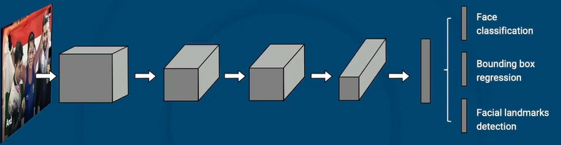
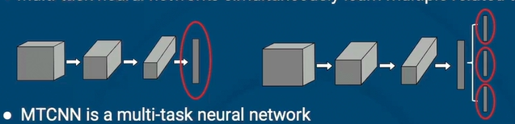
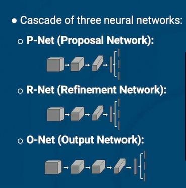
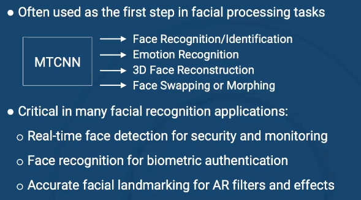
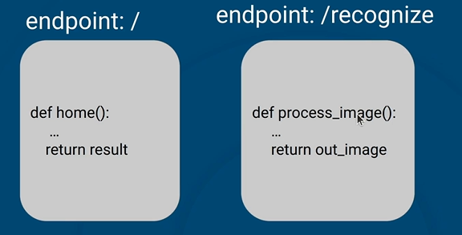

## 01 - Writing More Fault-tolerant Code

In Python, it's essential to develop the habit of writing fault-tolerant code. Fault-tolerant code is designed to gracefully handle errors and edge cases, ensuring that an application can continue to function even when faced with issues like network failures. Although writing fault-tolerant code may require additional upfront effort, it significantly improves an application's ability to handle real-world uncertainties and maintain operational integrity in challenging environments.

We'll explore this concept using two Python techniques:
* `try-except-else` blocks
* Tuple unpacking

## 02 Face Detection and Face Recognition
**Face Detection:**
|| Scan images for faces
|| Look for features (like edges and texture)
|| Mark areas with a face

**Face Recognition:**
Face embedding: face as a vector = faceprint
Face recognition: 
|| Search database of known faceprints
|| Compute similarly score

**Computational Methods**
* Traditional approaches
* Modren approaches using Deep Learning
     - MTCNN(multi-task Cascaded Convolutional Networks) - face detection
     - Inception ResNet - face recognition (face embeddings and face matching)

**Practical Applications**
* Security Systems
* Smartphones
* Social Media
* Law Enforcement
* Healthcare
* Virtual Reality

**Challenges**
* Technical Challenges
* Privacy Concerns
* Ethical issues with bias and fairness

## Exercise - Exploring and Preparing a Video Dataset
**Summary:** In this lesson, we'll learn how to work with video data and prepare it for face recognition tasks. We'll use a YouTube video of an interview with an Indian Olympic boxer Mary Kom. We'll shorten the original video and extract individual frames from it. After completing this, the data will be ready for use with facial detection and recognition models.

**Objectives:**

* Download video data from YouTube.
* Shorten the video and keep only the amount we need.
* Extract frames from the video at regular intervals.
* Display a subset of extracted frames.

## 03 - Multi-Task Convolutional Neural Network

### What is MTCNN?
* State-of-the-art face detection method
* Multi-task neural network simultaneously learn multiple related tasks
* MTCNN is a multi-task neural network
    - Face localization
    - Face classification
    - Facial landmark localization

### How MTCNNs Work

### MTCNN Advantages and Challenges

**Advantages**
* *Accuracy:* Great in challenging scenarios
* *Efficiency:* Cascading = filtering away non-face regions
* *Landmarks:* Detected landmarks help downstream tasks

**Challenges**
* *Computational Intensity:* Computational load can be huge
* *Extreme Orientations:* Detecting faces at steep is still a challenge

### MTCNNs in Practice 
facenet - pytorch library
   - pre-trained detection and face recognition models

Typical workflow using MTCNN: \
Load image -> Instantiate model and run on image -> Process bouding boxes, facial landmarks and probabilities

### Applications of MTCNNs

## Exercise - Face Detection using MTCNN
**Summary:** In this lesson, we'll use a pre-trained Multi-task Cascaded Convolutional Network (MTCNN) for face detection. We'll load the model from facenet_pytorch library and use it on images extracted from Mary Kom YouTube interview video. We'll demonstrate a variety of capabilities that a pre-trained MTCNN model comes with.

**Objectives:**
* Initialize a pre-trained MTCNN model from facenet_pytorch
* Detect faces in an image using MTCNN model
* Display the resulting bounding boxes of faces detected by the model
* Crop out detected faces for further analysis
* Determine facial landmarks such as eyes, nose, and mouth using the MTCNN model
* Select a subset of images for face recognition tasks in the next lesson

**New Terms:**
* Face detection
* MTCNN
* Facial landmarks

## 04 - Face Embeddings With Inception Resnet

**Facial Recognition**
Its applications include security, law enforcement, checking attendance, unlocking devices

### Face Embeddings
Face embeddings are vectors, mathematical representation of the extracted features of a face. 
* Often called a faceprint as it's a fingerprint of the face
* Each dimension represnts an executed feature from the face
* Dimensions range from 128 to 512

### Face Embeddings
* Embeddings that are close might be the same person
* Create a database of face embeddings of people we know the identity
* For a person we want to identify, generate the face embedding, and see which face embedding it's closest to in our database of embeddings.

### Inception-ResNet V1 Model
* Inception-ResNet V1 is based on the popular Inception V4 model with residual connections (ResNet)
* Inception architecture was first developed in 2014 by Google as a way to make better use of neurons
* Uses convolutional layers mde up of 1x1, 3x3, and 5x5 filters in parallel, extracting features at different scales.

* A residual connection is added to each inception module.
* The Inception-ResNet model are faster to train and performs better than the incpetion models. 

### Implementation with `facenet-pytorch`
* `facenet-pytorch` has the Incpetion-Resnet V1 model
* The Inception-ResNet V1 model was trained on the VGGFace2 dataset
* Made up of around 3.31million images of 9131 different people
* Has a very low label noise and high pose and age diversity

## Exercise - Inception-ResNet V1 for Facial Recognition
**Summary:** In this lesson, we'll use the Inception-ResNet V1 model for facial recognition. Specifically, we'll build a model to recognize the face of Mary Kom.

**Objectives:** 
- Detect faces using MTCNN 
- Create face embeddings with Inception-ResNet V1 
- Use created embeddings to recognize faces in images

**New Terms:** - Inception-ResNet V1 - Facial recognition - Face embedding

## 05 - Web APIs
A Web API (Application Programming Interface) allows different software systems to talk to each other over the internet, usually using HTTP (just like your browser).
* Think of it like a waiter in a restaurant:
* You (the client) ask for something (make a request).
* The kitchen (the server) prepares it.
* The waiter (API) delivers the result back to you (response).

**HTTP Methods: GET vs POST**

*GET*
* Used to retrieve data from a server.
* Like reading from a database.
* Example: GET /users might return a list of users.
Parameters (like search filters) go in the URL

*POST*
* Used to send data to the server.
* Like submitting a form or creating a new record.
* Data is sent in the body of the request, not in the URL.

### Web can send anything
* Not limited to text
* Can send aything: images, videos, files, data
* JSON common data format on web

### API
* API = Application Programming Interface
* Description of what actions will return what result
* One using request is Web API
* Often dynamic
* Request to endpoint is routed to code

### USer Interface
* Many APIs are just request endpoints
* Can use web page as interface
* Main endpoint brings up webpage, calls other endpoints
* Easier for users to work with

## Exercise: Making a Web App
**Summary:** In this lesson, we'll create a web app to run our face recognition utility. This will create a tool that anyone can upload a file to. The app will give them back an image with the faces outlined and labeled, at least for faces that it knows about. To build this tool, we'll need to work outside the notebook using a tool called Flask. Flask will set up a small web server running the app we'll create, that we'll be able to access like any web page.

**Objectives:**
* Make a series of functions we can call to do face recognition
* Create a py file so our app can use those functions
* Assemble a Flask app as a front-end to our face recognizer
* Test the app

**New Terms:**
* Modular
* Web app
* Route

## 06 - Ethics in Computer Vision: Facial Recognition Technology and Racial Profiling

**ETHICS IN COMPUTER VISION**\
In this series of readings, you'll explore the critical ethical and environmental issues facing the field of computer vision. These texts address topics such as bias in model training, privacy concerns, and the environmental impact. Through these readings, you’ll develop a nuanced perspective on the responsibilities of computer vision practitioners and gain practical insights into building models that prioritize ethical and environmental considerations.

Based on the article , ["Chinese Security Firm Advertises Ethnicity Recognition Technology While Facing UK Ban"](https://www.theguardian.com/world/2022/dec/04/chinese-security-firm-advertises-ethnicity-recognition-technology-while-facing-uk-ban) published by The Guardian.

**References**\
Hern, Alex. “Chinese Security Firm Advertises Ethnicity Recognition Technology While Facing UK Ban.” The Guardian, 5 Dec. 2022.

## 06- Community of Practice: Interview with Jurriaan Barkey Wolf

**COMMUNITY OF PRACTICE: PRACTITIONER INTERVIEWS**\
In this series of interviews, you'll gain insights into the real-world practices, values, and challenges faced by experienced data scientists working in computer vision. Each conversation will delve into the core concerns of the field—ranging from ethics, bias, and interpretability, to collaboration, and model deployment.

