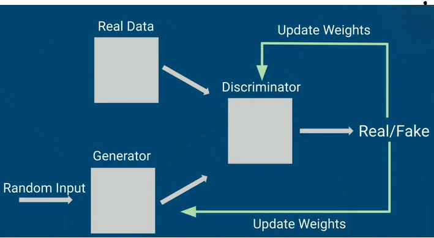
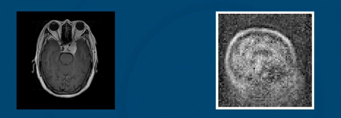

## 01- Executing System Commands in Python

In Python, we often need to interact with the command line interface (CLI) to execute system commands. This lesson will cover two widely-used methods for doing so: os.system and subprocess.run. We will also discuss how to work with exit status codes, handle permission errors when managing files, and capture the output of commands for further use.

## 02 - Generative Adversarial Networks
### The Need To Generate Images
* Medical scan images can be expensive to generate
* We'd like a way to generate medical images that looks realistic
* We can use generatuve AI to generate images, text and other data.
* Generatuve adversinal netwrok (GAN) is an architecture for generative AI.

### How GANs Work
* Two models compete against each other
* The generator outputs fake/generated data of the target type 
* The discriminator is trained to detect fake samples
* The generator generates data and the discriminator tries to detect if it's fake

### The Discriminator and Generator
* Both models are neural networks
* The discriminator is a binary classifier
* The generator takes a random input to generate a new instance
* A common loss function used is the minimax loss but others are used

`Ex [log(D(x))] + Ez [log(1 − D(G(x)))`

### Training GANs
* The generator generates a new sample
* The discriminator is fed either a real or the generated sample
* The results are used to update/improve the model's weights
* The discriminator gets better at detecting fake data
* This forces the generator to produce more realistic data
* Through enough training, the generator will be really at fooling the discriminator 

## Exercise - Generative Adversarial Networks\
**Summary:** In this lesson, we'll look at the Generative Adversarial Network or GAN. This is a system of two neural networks that we'll train to mimic a collection of existing images. When it's properly trained, we'll be able to generate brand new images that resemble the ones we started with. Here we'll be trying to generate new images of brain MRIs.

**Objectives:**
* Read in medical images, particularly brain MRIs
* Create the two adversarial networks
* Create a discriminator to tell real images from fake
* Create a generator to create new fake images
* Train the networks against each other
* Generate new images with the trained generator

**New Terms:**
* GAN
* Discriminator
* Generator
* Noise vector

## 03 - 3 Medigan

### Training a GAN
* Training two networks
* More difficult than a single one
* Made our own in the last lesson Need more training, larger network

### Medigan
* Can get pretrained models
* We want one that makes medical images
* Medigan is collection of GANS
* Each makes specific kind of image
* GANS trained to make one kind of image tend to do better at that task
* Images are right "shape"
* Details can be off

### Using a GAN
* All work on same principle
* Only using generator half of GAN
* Noise given to network, creates image
* Trained to trick discriminator trained on real x-rays or MRIS
* We call a function, specifying a model and how many images we want

## Exercise - Medigan\
**Summary:** In this lesson, we'll look at a collection of pre-trained GANs called medigan. These generate a variety of medical images, such as MRIs and X-rays of various body parts. We'll use this synthetic data to train a model to classify which parts of a medical image are of concern.

**Objectives:**
* Look at the Medigan collection of pre-trained medical image GANs
* Get descriptions of GANs and select the ones we want
* Generate images with a selected GAN
* Turn the GAN images into a data loader
* Train a model using the generated images

**New Terms:**
* Medigan
* Mask
* Tuning

## 04 - Streamlit

### Overview
* A Python library for building and sharing interactive web applications
* Designed for data analysis and machine learning models
* Allows data practitioners to convert data scripts into interactive, customizable web apps without extensive web development knowledge
* Uses a data flow model, re-runs the Python script from top-to-bottom on each user interaction
* A Streamlit app consists:
    * Python functions for data manipulation and machine learning
    * Streamlit-specific widgets and display elements

### Streamlit Examples
* Data visualization
* Interactive machine learning
* LLM

### BUILDING STREAMLIT APPS
* Creating an App
    - Write Python code in a .py file
    - Add Streamlit commands to create web elements
* Running the App
    - Launch the Streamlit app locally at the command line
    - View the app in a web browser
* Deployment
    - Streamlit Cloud
    - Other hosting providers

### Key Benefits
* **Integration:** Seamless integration with data science and machine learning libraries
* **Customization:** Theming, layout options, and advanced widgets
* **Community and Ecosystem:** Streamlit community of example apps and advanced extensions

## Exercise - Streamlit Web Application for Generating Medical Images\
**Summary:** In this lesson, we'll build a web application that generates images using GAN models. The app will allow users to choose a specific GAN model and specify the number of images to generate. We'll use the Python framework Streamlit to develop the app, and the code will be written in a .py file.

**Objectives:**
* Learn how to build a web application using Python's Streamlit framework
* Add custom interface features for interaction with GAN models
* Create a .py file for the web app

## 05 - Ethics in Computer Vision: The Quest to Develop Fair and Ethical Algorithms in Medical Imaging

### ETHICS IN COMPUTER VISION
In this series of readings, you'll explore the critical ethical and environmental issues facing the field of computer vision. These texts address topics such as bias in model training, privacy concerns, and the environmental impact. Through these readings, you’ll develop a nuanced perspective on the responsibilities of computer vision practitioners and gain practical insights into building models that prioritize ethical and environmental considerations.

The following is a fragment from the article [“The quest to develop fair and ethical algorithms in medical imaging.”](https://www.nibib.nih.gov/news-events/newsroom/quest-develop-fair-and-ethical-algorithms-medical-imaging)

**References**\
“The Quest to Develop Fair and Ethical Algorithms in Medical Imaging.” National Institute of Biomedical Imaging and Bioengineering, www.nibib.nih.gov/news-events/newsroom/quest-develop-fair-and-ethical-algorithms-medical-imaging.

## 05 - Community of Practice: Interview with Ahmed Danjuma

### COMMUNITY OF PRACTICE: PRACTITIONER INTERVIEWS
In this series of interviews, you'll gain insights into the real-world practices, values, and challenges faced by experienced data scientists working in computer vision. Each conversation will delve into the core concerns of the field—ranging from ethics, bias, and interpretability, to collaboration, and model deployment.

Through these interviews, you’ll discover how professionals approach problem-solving, make critical decisions, and balance technical rigor with ethical considerations, offering a holistic view of what it takes to succeed and innovate in applied machine learning.

### Interview with Ahmed Danjuma
In this interview, Ahmed Danjuma, co-founder and lead developer at NeuronBytes AI, discusses his journey into data science, starting from his early interest in turning numbers into meaningful insights, to working on complex AI projects in healthcare and security. He highlights a notable project involving an object detection system for shoplifting prevention, detailing the challenges and solutions implemented.

Ahmed emphasizes the importance of hands-on learning and practical experience for students entering the field of AI. He advises new learners to engage in their own projects alongside formal education to deepen their understanding. He also discusses the significance of diverse datasets in training AI models to avoid biases, particularly in healthcare.

Throughout the interview, Ahmed shares insights on effective communication with clients, adapting to different cultural expectations, and the importance of staying updated with the latest AI developments through hands-on projects, curated resources, and community engagement.