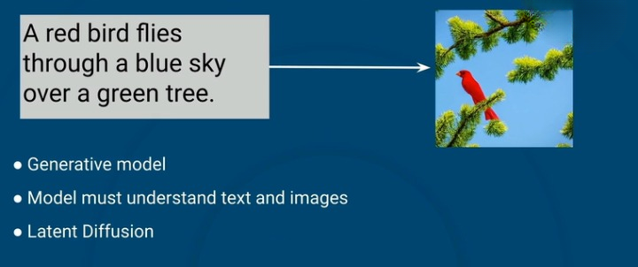
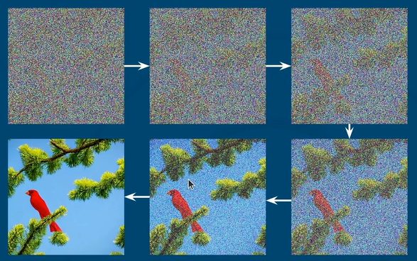
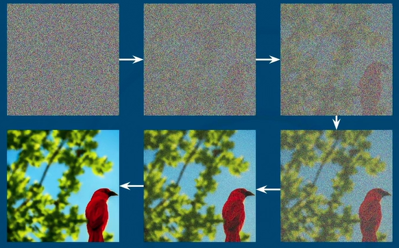
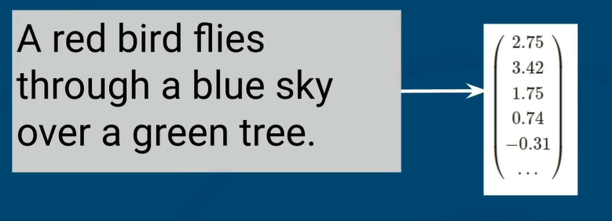
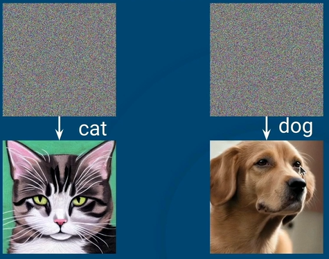
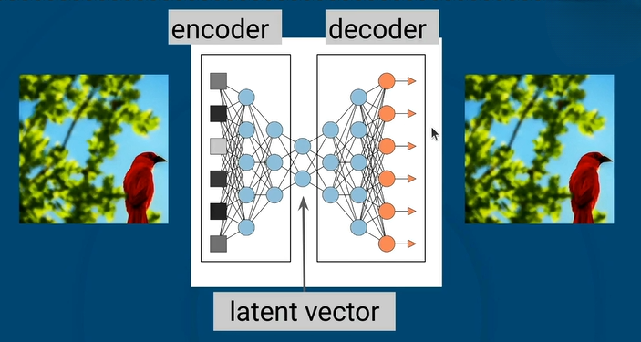
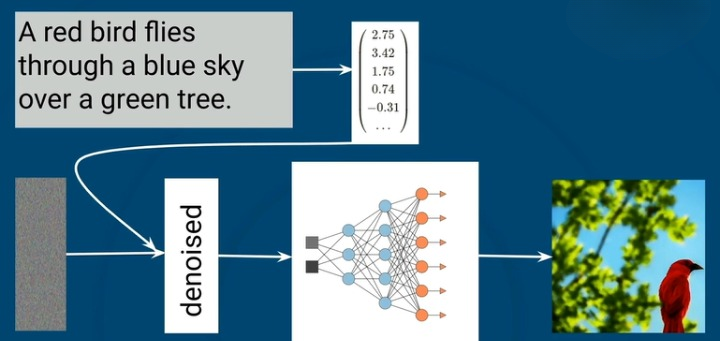
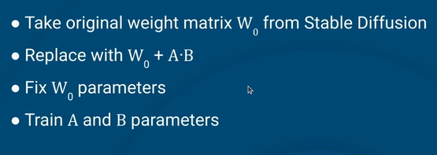

## 01 - Working With Environmental Variables

Python's `dotenv`, aka `python-dotenv`, is a popular third-party library that simplifies the management of environment variables for your projects. Environment variables can store configuration settings, such as general flags or parameters that your application uses, and sensitive information, API keys, database credentials, or application secrets.

The `dotenv` library allows you to store these variables in a separate file called .env, rather than hardcoding them directly into your notebooks or Python scripts. This separation of configuration from code offers several benefits:

1. Enhanced security: Sensitive information is kept out of your main codebase.
2. Easier maintenance: Configuration can be updated without changing your code.
3. Better portability: The same code can run in different environments by simply changing the `.env` file.
4. Improved collaboration: Developers can share code without exposing sensitive data.
By using a `.env` file, your Python application is more secure, flexible, and easier to maintain.

An `.env` file is an example of a "hidden" file. Files and directories that begin with a dot (.) are not displayed by default when listing contents using commands like ls or in graphical file managers. This convention helps distinguish these items from regular items and keeps directories less cluttered.

Let's explore common errors when using environment variables and the dotenv library.

## 02 - Stable Diffusion

### Text To Image

### Stable Diffusion
* Popular latent diffusin model
* Three components
* Denoising Diffusion Probabilistic Model (DPPM)
* Text Embedding
* Variational AutoEncoder (VAE)

### *Denoising Diffusion Probabilistic Model (DPPM)*

### DPPM On Noise
* UNet
* Specific

### Text Embedding

* Converts text to "embedding"
* Encode meaning
* Contrastive Language-Image Pre-Training (CLIP)
* Conditioning

#### Conditioning

### *Variational Autoencoders (VAE)*
* Image have a lot of features
* 512 x 512 x 3 = 786432
* Slow, uses a lot of resources
* Want to work in smaller space

### Latent Diffusion
* Deniosing on latent vectors
* Significantly less data, faster
* Conditioned on text
* Generate random latent 
* Deniose
* VAE decoder produces images

### Stab;e Diffusion
* Popular latent diffusion model
* Pre-trained components
* CLIP
* Latent deniosing
* VAE

## 03 - Fine-tuning with LoRA
* Want to get Stable Diffusion to produce customized images
* Thus, need to fine-tune the model
* But Stable Diffusion has a lot of parameters
* 3.3GB for the v1.4 model we're using!
* This would take a lot of time to complete

### Dimensionality Reduction
* **Common problem:** Want lower-dimensional representation of data
* **Many techniques boil down to:** Represent large matrix X (dxk) as product of two smaller matrices A.B (dxr and rxk, with r << d,k)
* Number of parameters drops from dk to r(d+k)
* A, B have rank of r, which is small in comparison.

### Low Rank Adaption (LoRA)

#### SETTING THE RANK
Setting rank r lets us trade speed for fidelity
* We can get very good results with very small r
* Default value of r = 4
* LORA weights stored in 3.1 MB (1000x savings!)

## 04 - Virtual Environment

#### REPRODUCIBLE PYTHON ENVIRONMENTS
* Your development environment has many libraries
* How many are really necessary for your script?
* Can we get a pristine Python install to work in?
     * ... without deleting our development environment?
* Virtual environments provide separate, brand-new copy of Python for exploration and testing

#### CREATING A VIRTUAL ENVIRONMENT
* In a terminal, run
     * python `-m venv` my-venv
* The `-m venv` argument means, run the "venv" Python module
* The my-venv name is arbitrary
* This does not make the virtual environment active

#### ACTIVATING A VIRTUAL ENVIRONMENT
* In a terminal, run
     * source `-m venv`/bin.activate
* The python command now runs in the virtual environment

#### INSTALLING PACKAGES
* The pip command installs into the activated virtual environmnet
      * pip install requests

#### RECORDING INSTALLED PACKAGES
* The pip freeze command lists all installed packages
* Output typically written to file named requirements.txt
     * pip freeze > requirements.txt
* These can be insatlled on another system with
     * pip install > -r requirements.txt

#### LEAVING A VIRTUAL ENVIRONMENT
* Exit the virtual environment
      * deactivate
* Delete the virtual environment
      * rm -r `my-venv`

## 05 - Ethics in Computer Vision: Inside the Taylor Swift Deepfake Scandal

### ETHICS IN COMPUTER VISION
In this series of readings, you'll explore the critical ethical and environmental issues facing the field of computer vision. These texts address topics such as bias in model training, privacy concerns, and the environmental impact. Through these readings, you’ll develop a nuanced perspective on the responsibilities of computer vision practitioners and gain practical insights into building models that prioritize ethical and environmental considerations.

The following is a fragment from the article ['Inside the Taylor Swift deepfake scandal: ‘It’s men telling a powerful woman to get back in her box’](https://www.theguardian.com/technology/2024/jan/31/inside-the-taylor-swift-deepfake-scandal-its-men-telling-a-powerful-woman-to-get-back-in-her-box)

**References**\
Saner, Emine. “Inside the Taylor Swift Deepfake Scandal: ‘It’s Men Telling a Powerful Woman to Get Back in Her Box.’” The Guardian, 31 Jan. 2024

## 05 - Community of Practice: Interview with Christopher Stephens

### COMMUNITY OF PRACTICE: PRACTITIONER INTERVIEWS
In this series of interviews, you'll gain insights into the real-world practices, values, and challenges faced by experienced data scientists working in computer vision. Each conversation will delve into the core concerns of the field—ranging from ethics, bias, and interpretability, to collaboration, and model deployment.

Through these interviews, you’ll discover how professionals approach problem-solving, make critical decisions, and balance technical rigor with ethical considerations, offering a holistic view of what it takes to succeed and innovate in applied machine learning.

### Interview with Christopher Stephens
In this interview, Dr. Christopher Stephens, the Director of Research at the Center for Complexity Science at the National University of Mexico, discusses his background and his experiences working with data related projects. His career transitioned from theoretical physics to statistical physics and eventually to applications in finance, economics, and artificial intelligence, particularly evolutionary computation. Dr. Stevens emphasizes the importance of predictive models that integrate data from various spatial resolutions and the use of Bayesian modeling techniques to combine qualitative and quantitative information.

He also highlights the challenges of combining data at different resolutions and the need for white-box machine learning frameworks for better decision-making. Dr. Stephens discusses the ethical considerations of data privacy, especially in healthcare, and the potential for predictive models to have both positive and negative outcomes. He advocates for data sharing and anonymization to unlock valuable insights while respecting privacy.